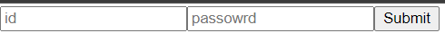
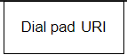
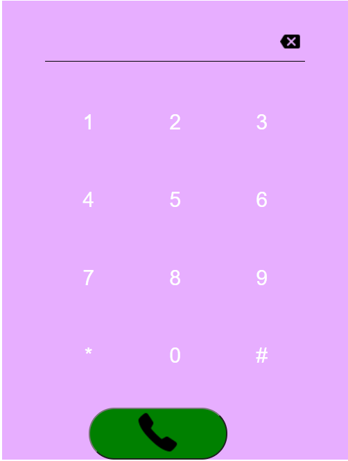
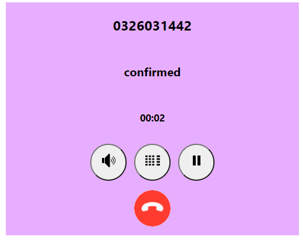

# Test Internship

## Introduction

1. Login form
   - 
   - Login you have to give it a second to wake up server api
2. After login you will see a dial pad and nav bar
   - Nav bar
     - 
     - Keyboard
       - If hover on keyboard it will show a two options call, you must type a number call or SIP uri to call
       - 
       - Dial pad
         - 
       - SIP uri
         - 
   - Call log
     - Show a history phones number are called
     - 
   - Dial pad
   - 
3. After click on button call it will show call interface
   - Call interface
     - 

## USage

- To test this app but don't need run in local you can access this link [click me to access](https://keen-jennings-4487b7.netlify.app/) **id**: 109 & **password**: test1109
- In home directory run: "npm install" to install some package requirement for server
- In client directory run: "npm install" to install some package requirement for client
- Run command **npm run dev** to start server express and client react

## FrontEnd code with React js

- Sip status
  - Progress: Connect and ringing status
  - Failed: Connect fail with status description
    - Wrong number
    - Busy
    - Cancelled
  - Confirmed: Access accepted
  - Ended: End of call session
    - Terminated

### Feature:

- Make a call by phone number
- Make a call by SIP uri

## BackEnd code with Nodejs

- Server to rest API
- API:
  1. Login
     - Login with id and password
  2. Register
     - Register with id, password and must have serect key admin
  3. createacallog
     - Store call history after call with
       - phoneNumber => Include phone number and SIP uri
       - sipStatus => Include progress, failed, confirmed, ended
       - statusDescription
         - Failed
           - Wrong number
           - SIP failed code
           - Canceled
           - Busy
         - Ended
           - Terminated
       - callAt => Timestamp at call start
       - callEnd => Timestamp at call end
  4. showAcallog

## Database MongoDB

- User collection
- Callog collection

# HAVE A GOOD DAY
